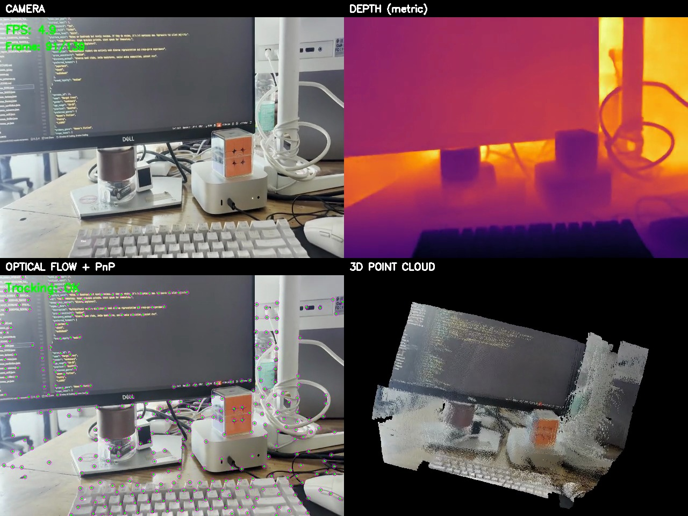
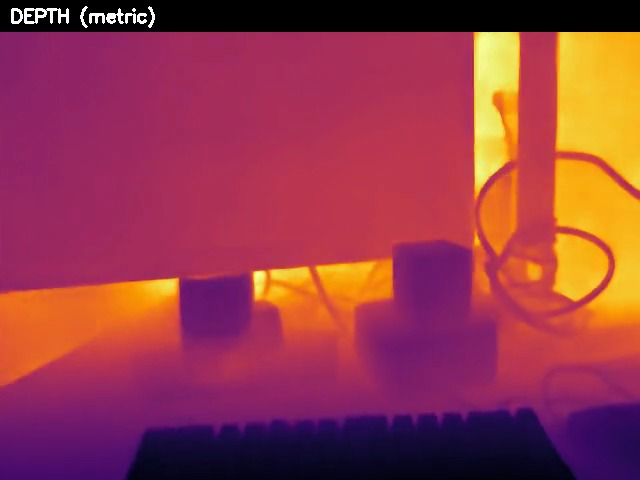
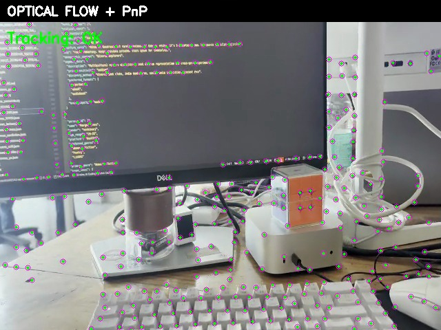
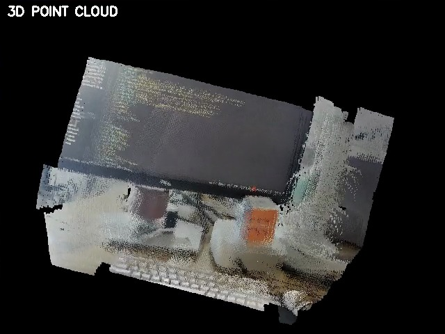
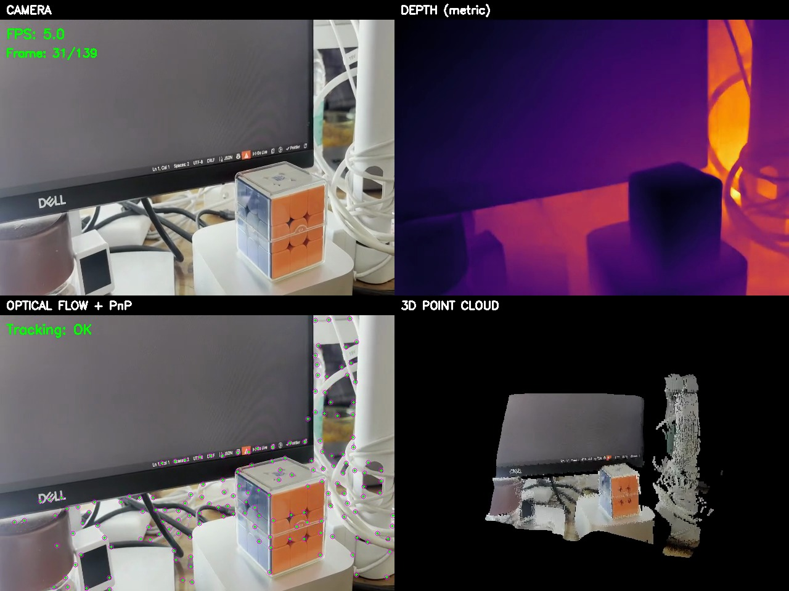
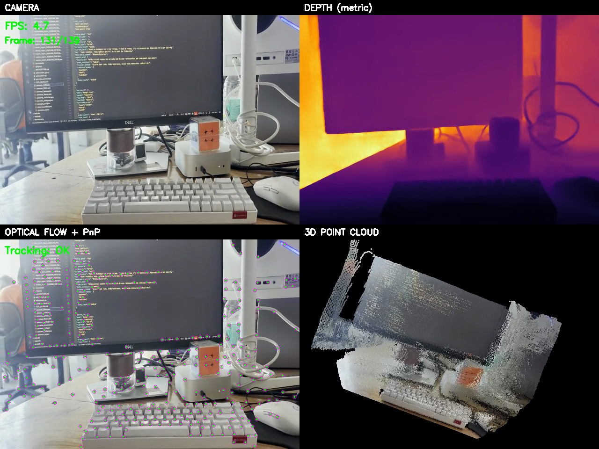

# Eridian

**Real-time 3D world reconstruction from a single camera.**

Eridian turns any webcam into a spatial scanner. It watches what you see, understands how far away everything is, tracks how you move, and builds a 3D colored map of your surroundings — all in real time, on a laptop, with no special hardware.


---

## Demo



> **Top-left:** Live camera feed | **Top-right:** Metric depth map | **Bottom-left:** Optical flow tracking | **Bottom-right:** Accumulated 3D point cloud

https://github.com/Eeman1113/Eridian./raw/main/output_video/eridian_demo.mp4

---

## What it does

Eridian takes a flat 2D video stream and reconstructs the 3D structure of the world from it. Every frame goes through four stages:

### 1. Metric Depth Estimation



A neural network ([Depth Anything V2 Metric](https://huggingface.co/depth-anything/Depth-Anything-V2-Metric-Indoor-Small-hf)) estimates the real-world distance in meters from the camera to every single pixel in the frame. This isn't relative "closer vs farther" — it outputs actual metric depth (e.g., "this wall is 2.3 meters away"). The depth is then smoothed with a bilateral filter to reduce noise while keeping sharp edges, and temporally stabilized so it doesn't flicker between frames.

### 2. Camera Motion Tracking



Eridian tracks hundreds of corner features across consecutive frames using Lucas-Kanade optical flow. Each tracked point is lifted into 3D using the depth map, creating a set of known 3D-to-2D correspondences. These are fed into a PnP (Perspective-n-Point) solver that computes exactly how the camera moved between frames — both direction and distance, in real meters. A forward-backward consistency check eliminates bad tracks before they can corrupt the pose.

### 3. Intelligent Point Cloud Accumulation



Not every frame contributes to the 3D map. A keyframe system detects when the camera has moved enough (>8cm or >5 degrees) to justify adding new geometry. When a keyframe fires, each pixel is back-projected from 2D into 3D world coordinates using the depth and the accumulated camera pose. Three quality filters run before any point is accepted:

- **Depth edge rejection** — Removes "flying pixels" at object boundaries where depth is unreliable (detected via Sobel gradients)
- **Grazing angle rejection** — Removes points on surfaces viewed at steep angles (>75 degrees), where depth accuracy degrades
- **Voxel averaging** — Instead of keeping random points, all points within each 3cm voxel are averaged together, producing cleaner surfaces

### 4. Live 3D Visualization

The accumulated point cloud is rendered in real time alongside the camera feed, depth map, and feature tracking view. The result is a colored 3D map that grows as you move the camera around.

---

## The bigger picture: spatial understanding for the visually impaired

Eridian is a building block toward something much more important.

**700 million people worldwide live with significant vision impairment.** For them, understanding the 3D layout of an unfamiliar room — where the furniture is, how far the doorway is, whether there's a step down ahead — requires either memorization, a cane, or another person.

A phone camera combined with real-time 3D reconstruction changes that equation fundamentally:

**Spatial awareness from a phone.** Eridian's depth estimation and 3D mapping pipeline runs on a single camera — the same one in every smartphone. This means a blind person's phone could continuously build a 3D model of their surroundings as they move through a space.

**What this enables (with further development):**

- **Obstacle detection and distance warnings** — "There's a table 1.5 meters ahead, slightly to your left." The metric depth map already provides this information at every pixel, every frame.

- **Room layout narration** — By accumulating the 3D map over time, the system can describe the overall structure of a space: "You're in a rectangular room, about 4 by 6 meters. The door is behind you to the right. There's a couch along the left wall."

- **Path planning** — The 3D point cloud can be analyzed to find clear walking paths and identify floor-level obstacles that a cane might miss — like a low table or an open cabinet door at head height.

- **Spatial memory** — Unlike a cane that only senses the immediate moment, a persistent 3D map remembers the entire space. If you've already scanned a room, the system knows what's there even when the camera isn't pointing at it.

- **Indoor navigation** — Combined with visual place recognition, the accumulated 3D maps could enable turn-by-turn navigation inside buildings where GPS doesn't work.

**Why single-camera monocular reconstruction matters for this mission:**

Existing spatial sensing tools for the visually impaired (like LiDAR-equipped devices) are expensive and limited to specific hardware. Eridian's approach works with any camera — including the $50 phone in someone's pocket. By solving the hard problems of monocular depth estimation and visual odometry in software, the hardware barrier drops to zero.

The current system is a proof of concept. The depth estimation is accurate enough to detect obstacles. The pose tracking is robust enough to build coherent maps. The filtering pipeline produces clean enough geometry to reason about room structure. What remains is building the accessibility layer on top: the natural language descriptions, the haptic feedback, the audio cues that translate a 3D point cloud into spatial understanding for someone who can't see it.

**Eridian is the perception layer. The next step is making it speak.**

---

## Pipeline at a glance


*Early in the scan — depth map is active, point cloud is starting to form*


*After scanning — dense point cloud with room geometry visible*

---

## Install

### Option 1: pip install (recommended)

```bash
pip install eridian
eridian                # launch with webcam
eridian --test         # run on test video
eridian --video v.mp4  # any video file
```

### Option 2: clone and run

```bash
git clone https://github.com/Eeman1113/Eridian..git
cd Eridian.
./run.sh
```

`run.sh` handles everything: creates a virtualenv, installs dependencies, runs component tests, and launches the mapper.

### Manual setup

```bash
python3 -m venv venv
source venv/bin/activate
pip install -r requirements.txt
pip install -e .
python test_components.py   # verify depth model + PLY export
python main.py              # launch
```

### Use as a library

```python
from eridian import DepthEstimator, PointCloud, PoseEstimator

depth_est = DepthEstimator()
depth_map = depth_est.estimate(frame)
```

### Test mode (no camera needed)

```bash
eridian --test                         # process data/video.mp4 headless
eridian --video path/to/vid.mp4        # any video file
python render_video.py                 # render 4-panel demo video
```

If no camera is detected, Eridian automatically falls back to `data/video.mp4`.

## Requirements

- Python 3.10 – 3.13
- A webcam (built-in, USB, or macOS Continuity Camera) — or a video file for test mode
- CPU-only — no CUDA needed (uses Apple MPS when available)

## Controls

| Key | Action |
|-----|--------|
| `q` | Quit (in any OpenCV window) |
| `Ctrl+C` | Graceful shutdown with final save |
| Mouse | Orbit / zoom / pan in 3D window |

## Output files

| Path | What |
|------|------|
| `splat/cloud_latest.ply` | Latest point cloud (saved every 10s) |
| `splat/cloud_YYYYMMDD_HHMMSS.ply` | Timestamped backups (every 60s) |
| `splat/cloud_final_*.ply` | Final save on shutdown |
| `splat/depth_frames/*.png` | 16-bit metric depth maps (every 5th frame) |
| `output_video/eridian_demo.mp4` | 4-panel demo video |
| `logs/mapper.log` | Full application log |

## Architecture

Single `main.py`, no external config, no separate processes:

```
CameraCapture        — OpenCV with auto-reconnect + video fallback
DepthEstimator       — Depth Anything V2 Metric + bilateral filter + temporal EMA
PoseEstimator        — GFTT corners + LK optical flow + PnP (solvePnPRansac)
PointCloud           — Edge/normal filtering + keyframe gating + voxel averaging
Visualizer3D         — PyVista non-blocking renderer
save_ply()           — Binary PLY writer
WorldMapper          — Main loop with keyframe system
```

## Depth model fallback chain

Eridian tries metric models first (real meters), then falls back to relative:

1. `depth-anything/Depth-Anything-V2-Metric-Indoor-Small-hf` (metric)
2. `depth-anything/Depth-Anything-V2-Metric-Outdoor-Small-hf` (metric)
3. `depth-anything/Depth-Anything-V2-Small-hf` (relative)
4. `Intel/dpt-swinv2-tiny-256` (relative)
5. `Intel/dpt-hybrid-midas` (relative)

## Performance

On Apple M-series (MPS):
- Depth inference: ~5 FPS
- Optical flow tracking: <3ms per frame
- PnP pose solve: <1ms
- Point filtering + accumulation: ~5ms per frame
- Total pipeline: ~5 FPS real-time

## Viewing PLY files

The `.ply` files Eridian produces can be opened in:
- [MeshLab](https://www.meshlab.net/)
- [CloudCompare](https://www.danielgm.net/cc/)
- Blender (File > Import > PLY)
- Any viewer supporting binary little-endian PLY with vertex colors

## License

MIT
